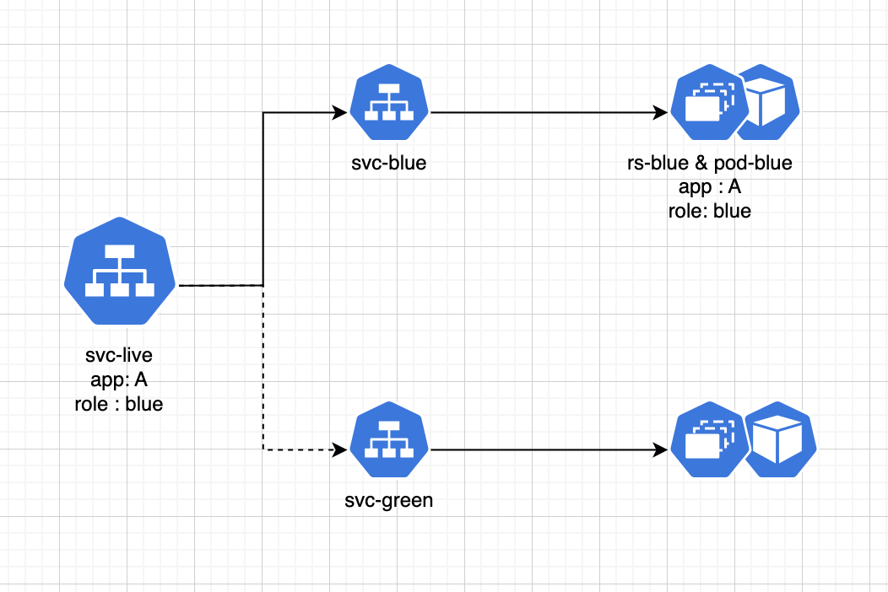

## Blue Green Deployment

The blue-green deployment strategy achieves releasing latest changes in the lower environments by maintaining two production environments that are as identical as possible. The also will enable to rollback as quickly as possible when the results are not as expected.

[#Credits - https://martinfowler.com/bliki/BlueGreenDeployment.html](https://martinfowler.com/bliki/BlueGreenDeployment.html)

In a kubernetes based deployment environment one way to do this is to have 3 service objects per application 

- Service
- Service-Blue
- Service-Green

all these service objects are properly labeled with matching labels to the replica/pod it belongs to; Example labels app, role

Assume that initially, our blue service is live.
The service is exposed to users via the svc-live Kubernetes service.
Requests are processed by the pod-blue Kubernetes pods, managed by the rs-blue Kubernetes ReplicaSet.
This setup was created using the deploy-blue Kubernetes deployment.

A local service, svc-blue, is also available for direct access to the pod-blue pods. This applies vice-a-versa for switch over to green

## Other Deployment stategies (unlike canary)
### Multi Region OOS based switch overs

OOS until validations are done (this is a legacy approach to distributing traffic by weightage from loadbalancer)

-  Region-A [OOS] 
-  Region-B  [live]
-  Region-C [live]